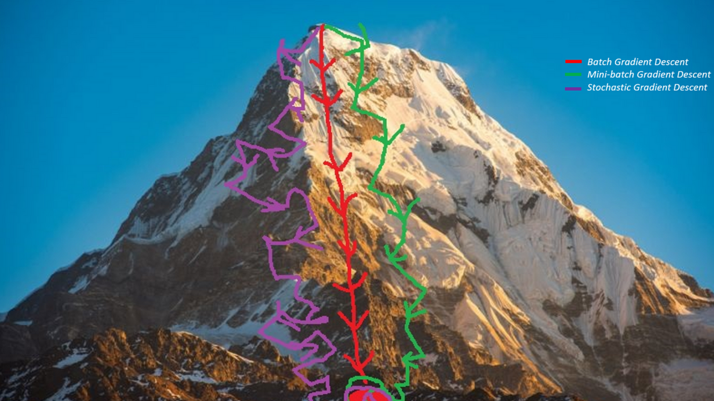
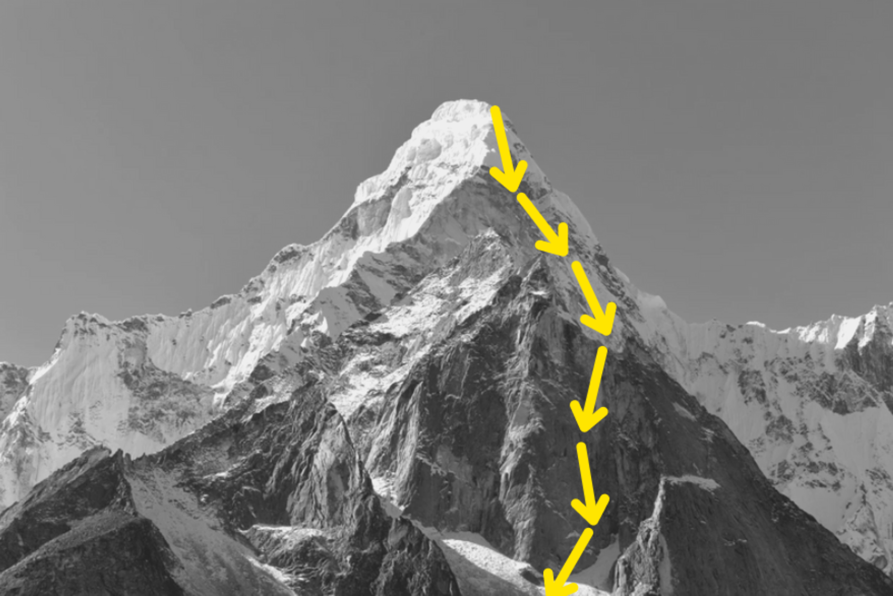
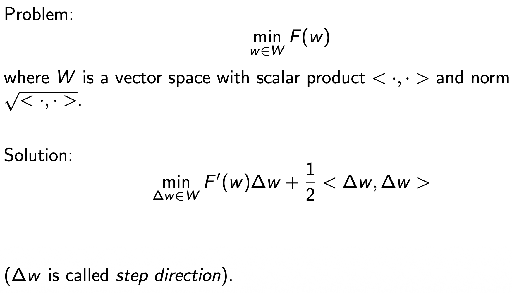
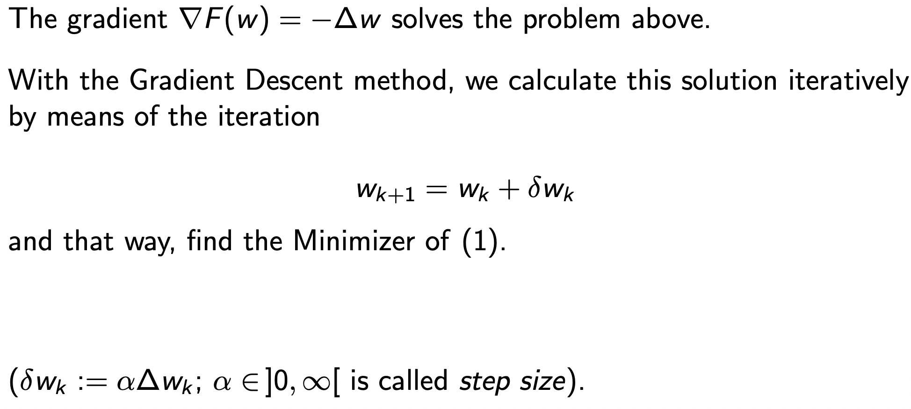
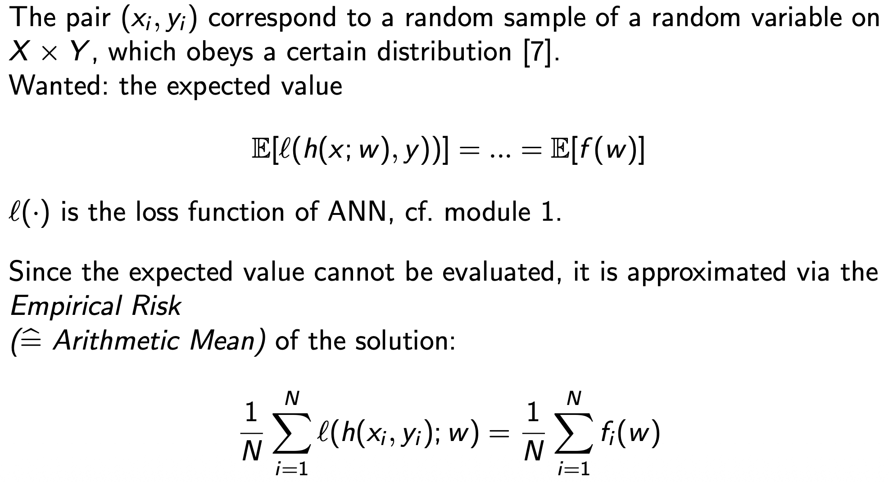
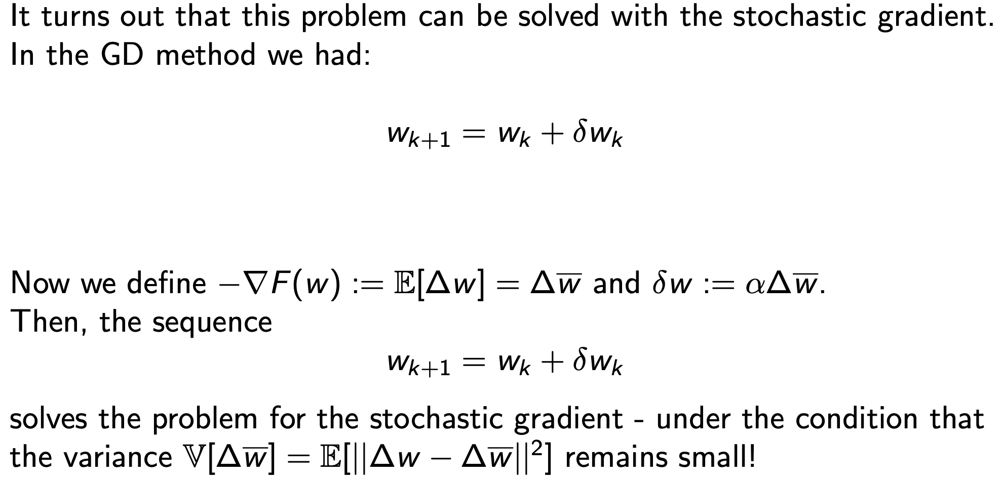
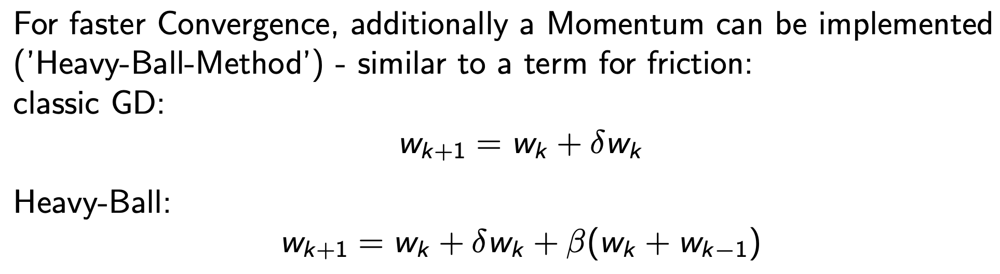

# Optimization

## Optimizer

An `optimizer` is an algorithm that adjusts the model’s parameters to minimize the loss function and improve performance over time.

## Gradient Descent Methods

### General Problem Definition

Gradient Descent can be visualized as repeatedly taking small steps downhill on the surface of the loss function until reaching the lowest point (the minimum). The direction of each step is determined by the negative gradient, and the size of the step is controlled by the learning rate.

### Gradient Descent (GD)

One of the most common optimization methods is `Gradient Descent (GD)`.  
This iterative approach updates model parameters by moving them in the direction that most reduces the loss — the `negative gradient`.

Each iteration determines:

- a `step direction` — the gradient of the loss function, and
- a `step size` — the _learning rate_, controlling how far the update moves.

Through repeated updates, the optimizer converges toward parameters that minimize the loss and improve the model’s predictions.

The general optimization problem can be formulated as:

### Stochastic Gradient Decent (SGD)

`Stochastic Gradient Descent (SGD)` is a variant of the Gradient Descent algorithm that updates model parameters using only a `subset of the training data`—typically a single sample or a small mini-batch—rather than the entire dataset.

This stochastic (randomized) approach significantly reduces computation time per iteration and allows the algorithm to handle very large datasets efficiently.  
However, because each update is based on only a small portion of the data, the resulting gradient estimates are noisy, which can cause the optimization path to fluctuate.  
Despite this, the inherent randomness can help escape shallow local minima and improve convergence in complex, non-convex loss landscapes.

To stabilize convergence, SGD is often combined with techniques such as `momentum`, `adaptive learning rates` (e.g., Adam, RMSProp), or `variance reduction` strategies.

#### Variance Reduction

The `variance` of the gradient estimates plays a crucial role in the `convergence behavior` of the Stochastic Gradient (SG) method.

High variance in stochastic updates can slow down convergence or cause oscillations around the optimal solution.  
To mitigate this, several `variance reduction techniques` are commonly applied:

1. `Dynamic Mini-Batch Sizing`  
   Gradually increasing the `mini-batch size` during training reduces the variance of gradient estimates as the optimization progresses.  
   Early iterations benefit from small batches (faster computation and exploration), while later iterations stabilize with larger batches (lower variance).

2. `Gradient Aggregation`  
   Aggregating gradients from `previous steps`, for instance by maintaining an `arithmetic mean` or an `exponential moving average`, smooths out fluctuations between successive updates.  
   This helps the optimization trajectory become more stable and consistent, improving convergence toward the global or local minimum.

In practice, variance reduction techniques are often combined with adaptive learning rate optimizers (e.g., `Adam`, `RMSProp`) to balance convergence speed and stability.

### GD with Momentum

`Gradient Descent with Momentum` is an extension of the basic Gradient Descent algorithm that accelerates convergence and helps avoid getting trapped in local minima.  
The idea is inspired by physical motion — instead of moving purely based on the current gradient, the optimizer also takes into account the `direction and magnitude of previous updates`, similar to inertia.

The momentum term smooths the optimization trajectory by accumulating an exponentially decaying moving average of past gradients.  
This allows the algorithm to maintain consistent movement along shallow slopes and dampen oscillations in directions of high curvature.

Momentum helps the optimizer build up speed in directions of consistent descent and reduces oscillations in noisy or steep gradient regions.  
As a result, it often converges faster and more smoothly than standard Gradient Descent.
