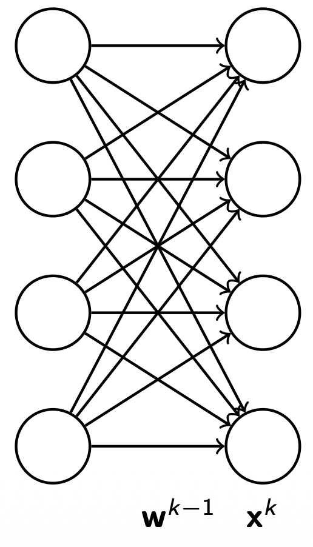
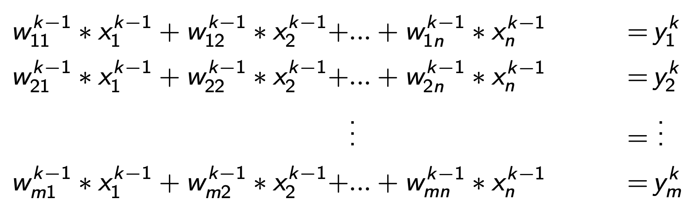

# Tensors

We represent data in neural networks using `tensors`.  
A `tensor` is a mathematical object that generalizes scalars, vectors, and matrices to higher dimensions.  
It can be thought of as a multi-dimensional array that encodes data of various orders.

## Tensor Orders

- A `0th-order tensor` is a `scalar` (a single numerical value, e.g., temperature or mass).
- A `1st-order tensor` is a `vector`, which represents magnitude and direction (e.g., velocity).
- A `2nd-order tensor` is a `matrix`, which can represent linear transformations or relationships between vectors.
- A `3rd-order` and higher-order tensor is referred to simply as a `tensor`, used to represent more complex, multi-dimensional data (e.g., color images, 3D volumes, or sequences).

Tensors form the core data structure in deep learning frameworks such as TensorFlow and PyTorch, enabling efficient computation across multiple dimensions and devices (e.g., CPUs and GPUs).

## Representing Operations with Tensors

Tensors not only store data but also enable efficient `mathematical operations` that represent computations in neural networks.

In a `Feed-Forward Neural Network (FNN)`, the values of the neurons in the k-th layer can be expressed as a `matrix–vector multiplication`:

