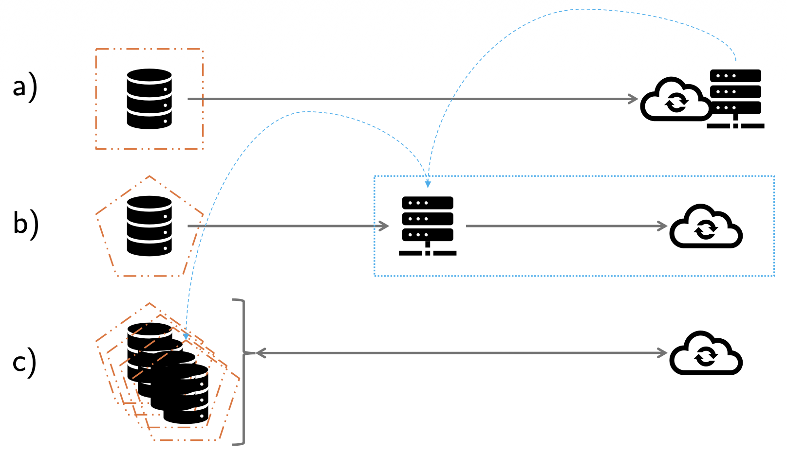
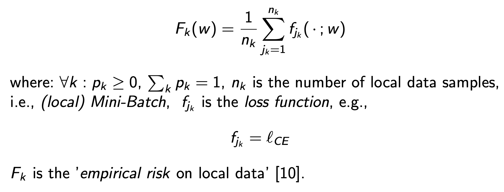
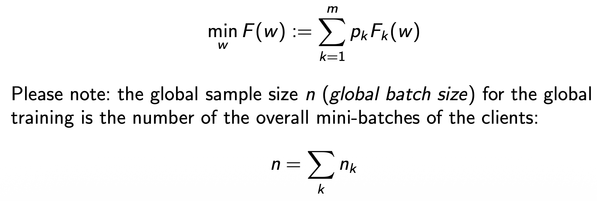
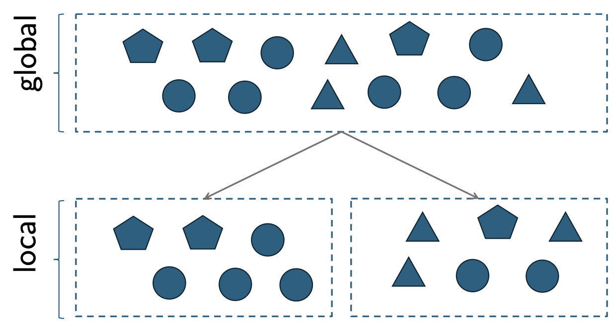

# Federated Learning

> “Data is the new oil.”  
> It’s valuable — but just like crude oil, it must be refined before it can be truly useful.

Federated Learning (FL) is a distributed ML approach where model training happens where the data resides (e.g., phones, hospitals, edge devices).
Instead of uploading raw data to a central server, participating clients compute local model updates and send only metadata (e.g., gradients or weights) to a coordinating server, which aggregates them into a new global model and broadcasts it back for the next training round.

## The Challenge of Classic Machine Learning

Traditional (centralized) `Machine Learning` relies on collecting and storing all data in one place — typically on powerful servers or in the cloud.  
This approach fueled a competition for building ever-larger models that could process vast amounts of data, leading to the rise of the centralized `“supercomputer.”`

However, this setup comes with significant challenges:

- Data must be `shared and centralized`, requiring users or organizations to `trust a single processing entity`.
- It demands substantial `computing power` and `storage capacity`.
- Centralized data handling raises `privacy, security, and regulatory concerns`, especially under strict frameworks like the EU AI Act.

## The Federated Learning Solution

`Federated Learning (FL)` addresses these limitations by enabling `collaborative model training` without sharing raw data.  
Instead of centralizing data, the learning process takes place locally — on devices or within organizations — while only `model updates (metadata)` are exchanged.

### Key Advantages

- `Privacy by design:`  
  No raw data leaves the device; only model updates are shared. This reduces, but does not eliminate, privacy risk. Practitioners typically add secure aggregation, differential privacy, and robust aggregation to harden guarantees.
- `Regulatory alignment:`
  With the EU AI Act (in force since 01-08-2024), organizations face stronger requirements around data governance, transparency, and risk management. FL can support compliance by minimizing central data collection and improving data provenance and access control.
- `Collaborative Learning with Sensitive Data:`  
  Enables cooperation between multiple institutions (e.g., hospitals, banks) — known as `cross-silo learning` — without exposing confidential information.
- `Efficiency & scale`:
  Training leverages decentralized compute, lowering server load and network transfer.
- `Efficient Resource Utilization:`  
  Leverages the `computational power of edge or mobile devices` for distributed training, known as `cross-device learning`.
- `Speed`:
  Frequent aggregation rounds enable “exchange of learning progress,” often shortening time-to-improvement compared to waiting for periodic central uploads.
- `Ubiquity of edge devices`:
  In the age of mobile and IoT, over half of the world’s population owns a smartphone (≈54% in 2023), making on-device learning broadly feasible.

Federated Learning thus combines the strengths of distributed computing and privacy-aware data management — allowing modern AI systems to learn from diverse, decentralized data sources while maintaining compliance and trust.

### Typical use cases

- On-device personalization (keyboards, recommendations) without uploading sensitive user text or behavior.
- Cross-institution healthcare or finance, where data cannot leave premises but joint models are valuable.
- Industrial/IoT settings with limited bandwidth or intermittent connectivity.

## The Idea of Federated Learning

Federated Learning represents the evolution from a centralized data paradigm to a `decentralized, privacy-preserving` learning architecture.  
It allows many devices or institutions to contribute to a shared model while keeping sensitive data secure and local.

- `a) Classic ML:`  
  Data is collected and processed on a `static device` or local system, then sent to a `central server` for training.  
  This setup requires data to be fully centralized, creating a single point of trust and potential risk.

- `b) Centralized ML with Mobile Devices:`  
  With the rise of mobile devices, data generation became distributed — yet, in traditional ML, all data is still `uploaded to a central server` for processing.  
  Although data now originates from multiple sources, privacy concerns and dependence on centralized storage remain.

- `c) Federated Learning (FL):`  
  In FL, data from `numerous mobile or edge devices` remains `local`, and only `model parameters` (e.g., gradients or weights) are shared periodically with the central server.  
  This enables `collaborative model training` without raw data exchange, combining data privacy with distributed computation.

## Utilization of Available Resources in Distributed Systems

Federated Learning leverages the `computational resources` of participating devices or clients within a `distributed system`.  
This approach significantly reduces the `memory and computing load` on the central (model or parameter) server, since most computations are performed locally on the clients.

However, this decentralized setup introduces a trade-off:  
while local computation increases efficiency and scalability, it also requires `periodic communication` between the clients and the server to synchronize model parameters.  
As the number of participating devices grows, the `communication overhead` can become substantial.

To maintain efficiency, an optimal balance must be found between:

- the number of `local training epochs` performed on each client, and
- the `frequency of communication rounds` with the central server.

The goal is to `maximize collaborative learning performance` while `minimizing communication costs`, ensuring that the overall system remains both scalable and efficient.

## Categories of Federated Learning

Federated Learning (FL) is typically divided into three main categories, depending on how the participating parties’ data differs in terms of `features (X)` and `samples (Y)`.

These three categories — Horizontal, Vertical, and Transfer Federated Learning — define how data is partitioned across participants and how collaboration is structured.  
Each approach balances `privacy`, `efficiency`, and `applicability` depending on the type and distribution of available data.

### I. Horizontal Federated Learning (HFL)

In `Horizontal Federated Learning`, the participating clients share `similar data features` (e.g., same structure, attributes, or schema) but have `different data samples`.  
This is common when multiple organizations collect the same type of data from different users — for example, several hospitals recording the same medical attributes for different patients.

`Example:`  
Banks in different regions with the same data structure (e.g., age, income, balance) but different customer bases.

### II. Vertical Federated Learning (VFL)

In `Vertical Federated Learning`, the participating clients share `the same data samples` (e.g., overlapping user bases) but have `different data features`.  
This setting applies when organizations serve the same customers but record different attributes.

`Example:`  
A bank and an e-commerce company both have data on the same customers, but one stores financial data while the other holds purchasing behavior.

### III. Federated Transfer Learning (FTL)

`Federated Transfer Learning` is used when the participating clients differ in `both data samples and data features`.  
In this case, `transfer learning` techniques are applied to transfer useful knowledge from one domain to another, enabling collaboration even when the data overlap is minimal.

`Example:`  
A healthcare provider and a wearable device company may have largely distinct user groups and data formats but can still benefit from shared model insights through transfer learning.

## Every Client Trains a Local Copy of the Model

In Federated Learning, each of the m participating clients trains its `own local copy` of the global model using its `private dataset`.

This local training process is conceptually similar to traditional (centralized) machine learning but occurs independently on each device.

The local objective function on client k is defined as:

Thus, each client minimizes its `local empirical risk` using standard optimization methods (e.g., SGD, Adam) before contributing model updates to the global aggregation step.

In essence, `each client learns locally`, preserving data privacy, while the `global model` evolves collaboratively through the aggregation of these distributed updates.

## Federated Average (FedAvg) – Collaborative Learning

In Federated Learning, each client trains its `local model` on private data.  
To ensure that clients (without exchanging data) can still `benefit from the collective learning progress`, their updated `model parameters` are `periodically sent to the central server`.

The server aggregates these updates to form a new `global model` that reflects the combined learning of all clients.  
This aggregation is typically performed by computing a `weighted average` of the local model updates — a method known as `Federated Averaging (FedAvg)`.

Federated Averaging enables efficient and privacy-preserving collaboration by combining local learning outcomes into a unified global model, ensuring that all participants contribute to and benefit from collective intelligence.

## The Non-IID Problem

In Federated Learning, the data stored on each client typically differs due to factors such as `user behavior`, `device usage`, `network availability`, and `data collection context`.  
As a result, the combined data across all clients cannot be assumed to be `independent and identically distributed (IID)`.

This leads to what is known as the `non-IID problem`.

Such heterogeneity can significantly affect model performance and convergence, as each local model learns from data with different characteristics or label distributions.

This phenomenon can be simulated by `unevenly distributing` the global dataset among clients, resulting in subsets that emphasize different features or classes of data.

`Example:`  
If the global dataset contains images of cats, dogs, and birds, one client might receive mostly cat images, another mostly dogs, and a third mostly birds — creating a non-IID distribution.
