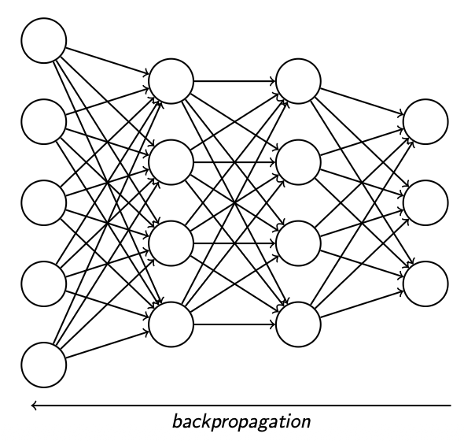

# Basics of Machine Learning

`Machine Learning (ML)` is a method of teaching computers to recognize patterns in data and make predictions or decisions without being explicitly programmed.

In essence, it is a form of `data fitting`, where we aim to find the optimal

- `model parameters` w ∈ W
- for a given `input` x ∈ X
- and `output` y ∈ Y
- within a `model` h(·; w )
- such that: h(x; w) = y

## Types of Machine Learning

Machine Learning can be broadly categorized into three types:

- `Supervised Learning` (e.g., classification, regression)
- `Unsupervised Learning` (e.g., clustering, dimensionality reduction)
- `Reinforcement Learning` (e.g., robot navigation, game strategies)

In `Supervised Learning`, the data is labeled, and the model learns from examples with known outcomes. The model receives feedback indicating whether its predictions are correct, allowing it to adjust and improve over time.

In `Unsupervised Learning`, by contrast, the data is unlabeled. The model must discover hidden patterns or structures in the data on its own, such as grouping similar items or identifying latent features.

In `Reinforcement Learning`, an agent interacts with an environment and learns optimal actions through trial and error, guided by rewards and penalties.

## Backpropagation

To train a neural network, we need to communicate the `error or deviation` of the output back through the network to adjust its parameters.  
This process is called `backpropagation`.

During backpropagation, the gradient of the loss function with respect to each weight and bias is computed by applying the `chain rule` of calculus.  
This allows the network to determine how each parameter contributed to the overall error.

The weights and biases are then updated to reduce this error, gradually improving the model’s predictions.

`Illustration:`  
The deviation between the model’s prediction and the true value is measured and propagated backward through the network.  
Due to the chain-linked dependencies of neurons, this propagation proceeds iteratively from the output layer back to the input layer — a process known as `backpropagation`.

## Overfitting

Overfitting occurs when a machine learning model learns the training data too well, including its noise and outliers, resulting in excellent performance on training data but poor generalization to new, unseen data. In other words, the model becomes too specialized to the training set and fails to capture the underlying patterns that apply more broadly.

## The Loss Function

The `loss function` measures how far the model’s predictions are from the actual target values.  
This quantified error is used to adjust the model’s parameters and improve its accuracy during training.

### Mean Square Error (MSE)

The `Mean Square Error (MSE)` measures the average squared difference between the predicted values and the actual (true) values.  
It quantifies how close the model’s predictions are to the real outcomes — smaller values indicate better performance.  
Because the errors are squared, larger mistakes are penalized more heavily, making MSE particularly sensitive to outliers.

### Cross-Entropy-Loss (binary Classification)

Here, C denotes the set of classes, β is a binary indicator (e.g., ±1), and p\_{o,c} represents the predicted probability that an object o belongs to class c.

The `cross-entropy loss` measures the difference between the predicted probability distribution and the true class labels.  
It penalizes confident but incorrect predictions more strongly, encouraging the model to output probabilities that reflect true likelihoods.
