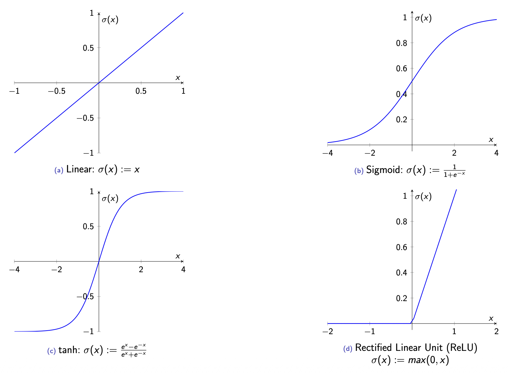

# Neural Networks

## Types of Neural Networks

### Artificial Neural Networks (ANNs)

`Artificial Neural Networks (ANNs)` are computational models inspired by the human brain’s structure. They are particularly effective for complex tasks such as `image classification`, `speech recognition`, and `natural language processing`.

`Example`:

- Input x ∈ X: a lot of pictures.
- ANN h(·; w ): a lot of parameters
- Output y ∈ Y: cat / dog

#### Artificial Neuron

An `artificial neuron` processes weighted inputs from preceding neurons and outputs a signal to the next layer when activated.  
It can be represented mathematically as a `weighted sum` followed by an `activation function`.

#### Activation Functions

`Activation functions` determine when a neuron should "fire" and introduce non-linearity into the network, enabling it to learn complex patterns.

### Feed-Forward Neural Network

A `Feed-Forward Neural Network (FNN)` is a type of Artificial Neural Network where the information flows in one direction — from the input layer, through one or more hidden layers, to the output layer.  
Each neuron passes its output to the next layer without feedback loops.

### Convolutional Neural Networks (CNNs)

For more complex data structures, such as 2D arrays (e.g., images), `Convolutional Neural Networks (CNNs)` are used.  
CNNs apply convolutional filters that capture spatial hierarchies and local dependencies in the data.  
This approach bridges the gap between small networks that lack expressive power and large networks that risk `overfitting`.

